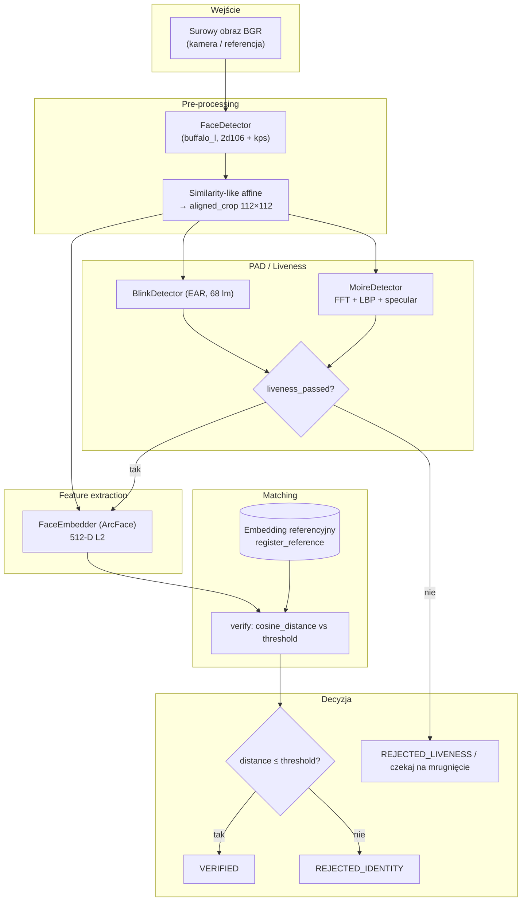

# Dokumentacja techniczna — system weryfikacji twarzy z liveness (`space-liveness`)

Ten dokument opisuje architekturę, przepływ danych i założenia ewaluacyjne projektu w katalogu **`space-liveness/`**. Produkcja **live verification** opiera się na `VerificationPipeline` (InsightFace / ArcFace + moduł PAD). Część interfejsu Hugging Face (`src/gradio_app.py`) wykorzystuje dodatkowo **DeepFace** (anti-spoofing + wyszukiwanie w `db/ja`) — jest to alternatywna ścieżka integracyjna, nie ten sam pipeline co `VerificationPipeline`.

---

## 1. Przegląd architektury systemu (System Architecture Overview)

System realizuje **weryfikację 1:1** (porównanie twarzy z próby z jednym wektorem referencyjnym) po spełnieniu warunków **Presentation Attack Detection (PAD)**. Logiczny podział odpowiada klasycznemu łańcuchowi FR + PAD [6, 8, 14, 15].

### 1.1 Pre-processing — detekcja i alignment

- **Wejście:** klatka BGR z kamery lub obraz referencyjny (dowolna rozdzielczość).
- **Detekcja:** pakiet modeli **InsightFace `buffalo_l`** (`FaceAnalysis`) — detektor **2d106** z landmarkami 106-punktowymi oraz mapowaniem na **68 punktów iBUG** (`landmark_3d_68`) używane dalej w PAD.
- **Alignment:** z **5 keypoints** (`face.kps`) estymowana jest **transformacja afiniczna ograniczona do podzbioru similarity** (`cv2.estimateAffinePartial2D` — 4 stopnie swobody: skala, rotacja, translacja), która mapuje punkty twarzy na szablon **ArcFace 112×112** (`_ARCFACE_DST`). Wynik: **`aligned_crop` 112×112×3 BGR** — wejście zgodne z modelem rozpoznawania [2, 6].

W batchu przygotowania zbiorów LFW/AgeDB (`src/vision/face_detector_batch.py`) stosowany jest **`insightface.utils.face_align.norm_crop`** z 5 punktów wyciągniętych z landmarków 106 (indeksy `[38, 88, 86, 52, 61]`), z trybem `arcface` — spójna filozofia geometryczna z ścieżką live.

### 1.2 Presentation Attack Detection (PAD / Anti-spoofing)

Moduł **`PADPipeline`** (`src/pad/liveness.py`) łączy:

1. **BlinkDetector** — **EAR (Eye Aspect Ratio)** na landmarkach 68-punktowych; wymaga sekwencji klatek z zamknięciem oka przez minimalną liczbę kolejnych ramek (`EAR_CONSEC_FRAMES`), co ogranicza **ataki fotograficzne / wydruki** bez dynamiki powiek [14, 15].
2. **Timeout mrugnięcia** (`BLINK_TIMEOUT_FRAMES`) — brak mrugnięcia przy widocznej twarzy przez ustalony czas traktowany jest jako **odrzucenie sesji** (scenariusz „statyczna prezentacja”).
3. **MoireDetector** (na `aligned_crop`) — heurystyki **FFT** (energia poza niskimi częstotliwościami), **LBP** (wariancja znormalizowanego histogramu) oraz **udział specular highlights** w HSV; cel: sygnalizacja **prezentacji twarzy z ekranu** (moiré, siatka pikseli, odbicia).

**Decyzja `liveness_passed`:** `blink_detected` **and** brak progu ekranowego **and** brak timeoutu.

> Uwaga: w tym samym repozytorium istnieje osobna ścieżka **DeepFace** (`static_test.py`, część `gradio_app.py`) z wbudowanym anti-spoofingiem — to **inna implementacja PAD**, nie `PADPipeline`.

### 1.3 Ekstrakcja cech (Feature extraction) — embeddingi i metric learning

- **Domyślny backend produkcyjny:** **ArcFace** (ResNet-50 w pakiecie `buffalo_l`) → wektor **512-D**, **L2-normalizowany** po ekstrakcji (`FaceEmbedder.embed`).
- **Warianty badawcze w UI:** ViT-B/16 (768-D, bez głowicy klasyfikacyjnej), SwinFace (512-D) — patrz `src/gradio_app.py`, `src/vision/swinface_embedder.py`.
- **Metric learning:** trening ArcFace opiera się na funkcjach straty typu **angular / additive margin** w przestrzeni hiperkulistej; w inferencji używa się **podobieństwa kosinusowego** (po L2 normie równoważnego iloczynowi skalarnemu) [9, 10, 11].

### 1.4 Dopasowanie i metryki (Matching & evaluation)

- **Skalar decyzyjny:** dla wektorów znormalizowanych L2 przyjęto  
  **`cosine_distance = 1 - dot(v_probe, v_ref)`** (klip do [0, 2]) — patrz `FaceEmbedder.verify` w `src/vision/embedder.py`.
- **Próg:** `VERIFICATION_THRESHOLD = 0.1625` — w kodzie opisany jako próg przy **EER** w ujęciu **cosine distance**, **skalibrowany w kontekście AgeDB-30** (dokumentacja w komentarzach modułu embeddera) [11, 12, 13].
- **FAR / FRR / EER:** w ujęciu weryfikacji 1:1 przy zmianie progu \(t\):
  - **FRR** (False Rejection Rate): odsetek **genuine pairs** z dystansem \(> t\) (błędne odrzucenie).
  - **FAR** (False Acceptance Rate): odsetek **impostor pairs** z dystansem \(\leq t\) (błędna akceptacja).
  - **EER (Equal Error Rate):** próg, przy którym **FAR ≈ FRR**; pojedyncza liczba charakteryzująca punkt operacyjny systemu [12, 13].

---

## 2. Schemat przepływu danych (Mermaid)

Poniższy diagram odnosi się do **głównego pipeline’u** `VerificationPipeline` (`src/pipeline.py`).

---

## 3. Szczegóły techniczne (Technical Details)

### 3.1 Face alignment (similarity transform) a jakość embeddingów [2, 6]

**Problem:** sieć ArcFace jest trenowana na twarzach **znormalizowanych geometrycznie** — stała skala (inter-pupillary distance), frontalizacja w przybliżeniu i stałe ułożenie cech w siatce 112×112.

**Rola alignmentu:** estymacja **transformacji afinicznej z ograniczeniem similarity** (przez `estimateAffinePartial2D`) na 5 punktach charakterystycznych usuwa dominującą zmienność **pozy, skali i płaskiego obrotu** przed wejściem do sieci. Dzięki temu embeddingi są **bardziej stabilne** dla tej samej tożsamości przy naturalnych wariacjach kadru, a separacja **genuine vs impostor** w przestrzeni kosinusowej jest bliższa założeniom treningu metric learning.

**Konsekwencja praktyczna:** pominięcie alignmentu lub użycie niespójnego szablonu punktów **degraduje** rozkłady dystansów i **psuje kalibrację progu** (np. EER).

### 3.2 PAD a ISO/IEC 30107 [14]

**ISO/IEC 30107** dotyczy oceny **Presentation Attack Detection** — odróżniania **bona fide** (żywa prezentacja) od **presentation attacks** (np. wydruk, ekran, maska).

Moduł `PADPipeline` realizuje **heurystyczny, wielocue’owy PAD** na poziomie aplikacji:

- **PAI (Presentation Attack Instrument)** ograniczony statycznym obrazem → mitigacja przez **wymuszenie mrugnięcia** i timeout.
- **PAI** oparty o **ekran** → mitigacja przez **analizę tekstury i widma (FFT, LBP, refleksy)**.

Pełna zgodność z ISO/IEC 30107 wymagałaby formalnego **protokołu testów** (np. poziomy ataków, metryki APCER/BPCER, raportowanie w kontekście PAD framework) — obecna implementacja to **inżynierskie wdrożenie cue’ów PAD**, a nie samodzielny, certyfikowany evaluator ISO.

### 3.3 Klasyfikacja vs open-set recognition a wektory 512-D [10, 11]

- **Klasyfikacja zamknięta (closed-set):** ustalony zbiór klas \(C\); model zwraca ** softmax** nad \(C\) — nowa tożsamość poza \(C\) jest **nieobsługiwana** (wymaga retreningu lub rozszerzenia ostatniej warstwy).
- **Weryfikacja / open-set w praktyce FR:** zamiast etykiety klasy ekstrahuje się **embedding** \( \mathbf{e} \in \mathbb{R}^{512} \) i porównuje z **galerią** lub **jednym szablonem referencyjnym** przez **metrykę** (kosinus / euklides po normie). Tożsamości spoza zbioru treningowego mogą być **reprezentowane**, o ile sieć dobrze generalizuje (cele: **compactness** wewnątrz klasy, **separacja** między klasami) — to jest sedno **face recognition jako metric learning** [10, 11].

W tym projekcie **512 wymiarów** to wymiar cech ArcFace; decyzja **MATCH / NO MATCH** to **binary decision na dystansie** przy ustalonym progu, bez klasyfikacji do stałej listy ID — typowy **1:1 verification** w paradygmacie open-world identity.

---

## 4. Protokół ewaluacji i zbiory LFW / AgeDB [3, 4, 12, 13]

### 4.1 Co jest zaimplementowane w `space-liveness`

Skrypt **`src/vision/face_detector_batch.py`** przygotowuje **wyrównane cropy 112×112** dla struktur katalogów LFW i AgeDB:

- Lista plików: **`img.list`** (nie występuje w repozytorium plik o nazwie **`pair.list`**).
- Obrazy: podkatalog **`imgs/`**.
- Wynik: zapis **`data/aligned/{lfw|agedb}/`** oraz **`detection_stats.csv`** (statystyki detekcji).

To jest **etap preprocessingu** pod dalszą ewaluację embeddingów, a nie sam licznik FAR/FRR.

### 4.2 Jak łączy się to z klasycznymi protokołami „par”

W literaturze i benchmarkach:

- **LFW** — standardowo używa się pliku **par** (np. **`pairs.txt`**: 6000 par, połowa genuine, połowa impostor) do szacowania dokładności weryfikacji przy ustalonym progu [3, 12].
- **AgeDB-30** — protokół weryfikacji z uwzględnieniem **wariacji wieku**; typowo raportuje się m.in. **EER** / najlepszy próg — zgodnie z komentarzami w kodzie, próg **`0.1625`** jest **powiązany z kalibracją na AgeDB-30** (jako odniesienie operacyjne dla ArcFace w tym projekcie) [4, 13].

**Mapowanie na ten kod:**

1. **Wyrównanie:** uruchomić batch alignment (`face_detector_batch`) tak, aby każdy obraz z `img.list` miał odpowiadający plik w `data/aligned/...`.
2. **Embeddingi:** dla każdej ścieżki obliczyć `FaceEmbedder.embed` na cropie 112×112.
3. **Lista par:** użyć **oficjalnej listy par** danego benchmarku (dla LFW: `pairs.txt`; dla AgeDB: pliki protokołu dostarczone z zestawem) — jeśli lokalnie lista nazywa się inaczej (np. konwencja `pair.list`), musi ona **zawierać identyfikatory / ścieżki** pozwalające zmapować parę obrazów na dwa embeddingi.
4. **Krzywe i EER:** dla każdej pary obliczyć `cosine_distance`; zmieniając próg \(t\) policzyć **FAR** i **FRR**; **EER** to punkt równowagi (np. interpolacja tam, gdzie FAR≈FRR).

### 4.3 Zależność od preprocessingu

Różnice między **norm_crop** (batch) a **estimateAffinePartial2D + warpAffine** (live) są **niewielkie** przy tych samych landmarkach docelowych ArcFace, ale przy ścisłej odtwarzalności wyników benchmarku należy **użyć tej samej ścieżki alignmentu** co w publikowanym porównaniu.

---

## 5. Bibliografia skrótowa (odniesienia do numerów [cite: …] w briefie)

| Oznaczenie | Temat |
|------------|--------|
| [2], [6] | Face alignment, szablony ArcFace, wpływ geometrycznej normalizacji na FR |
| [3], [4] | Zbiory **LFW**, **AgeDB** i protokoły weryfikacji |
| [8] | Pipeline detekcja → alignment → embedding w systemach FR |
| [9], [10], [11] | ArcFace / metric learning, embeddingi, weryfikacja kosinusowa |
| [12], [13] | FAR, FRR, EER w systemach biometrycznych |
| [14], [15] | Presentation Attack Detection, anti-spoofing |

---

## 6. Skrót ścieżek modułów (`space-liveness`)

| Komponent | Plik |
|-----------|------|
| Orkiestracja live | `src/pipeline.py` |
| Detekcja + alignment | `src/vision/detector.py` |
| Embedding + `verify` | `src/vision/embedder.py` |
| PAD (EAR, FFT, LBP, specular) | `src/pad/liveness.py` |
| Batch LFW/AgeDB | `src/vision/face_detector_batch.py` |
| UI (Gradio) | `src/gradio_app.py`, `app.py` |
| Test statyczny DeepFace | `src/static_test.py` |

---

*Dokument wygenerowany na podstawie analizy kodu w katalogu `space-liveness/`.*
