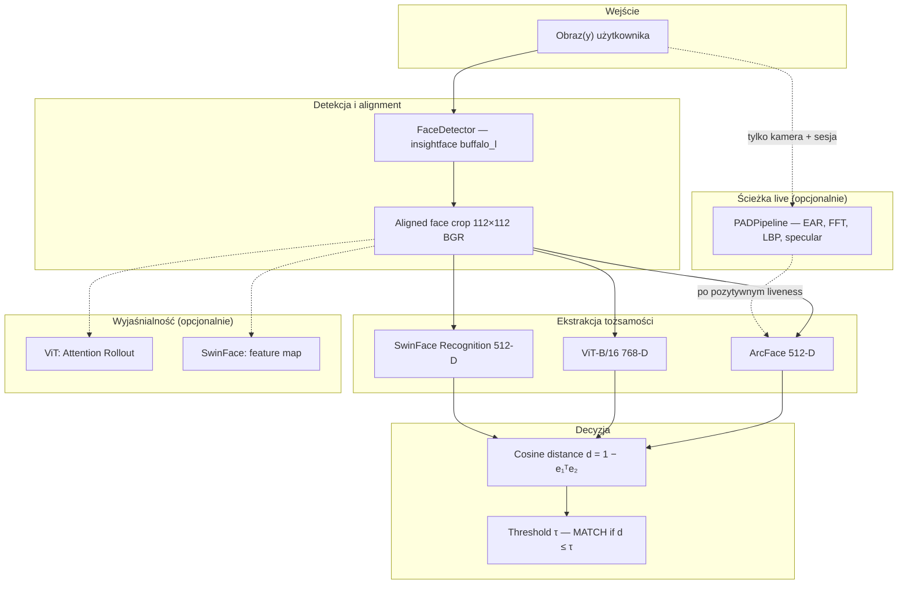
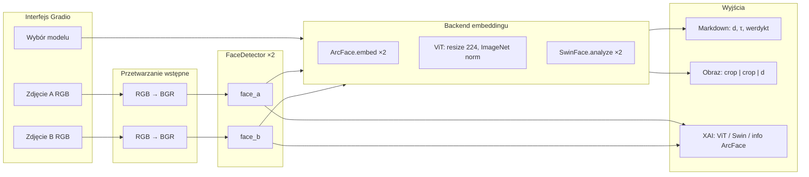

# Podsumowanie: pipeline weryfikacji twarzy — aplikacja `space-main/`

Dokument opisuje **end-to-end** działanie tego pakietu Gradio (m.in. **Hugging Face Spaces** — punkt wejścia `app.py`). Skupia się na **„Analizie badawczej — dwa zdjęcia”** oraz na warstwie modułów. Na końcu są **diagramy pod artykuł naukowy** (Mermaid → eksport SVG/PDF).

**Uruchomienie (z katalogu `space-main/`):** `uv run app.py` (port: `PORT` / `GRADIO_SERVER_PORT`).

---

## 0. Specyfika tej aplikacji względem innych wariantów w repo

- **`VerificationPipeline`** (insightface / ArcFace + PAD) jest **ładowany leniwie** przy pierwszym użyciu (`_get_pipeline()` w `src/main.py`), a nie przy imporcie modułu — na HF Spaces ogranicza to ryzyko timeoutu healthchecka podczas pobierania wag `buffalo_l`.
- **`analyze_two_images()`** pobiera detektor przez `_get_pipeline()._detector`; pierwsze porównanie ArcFace lub pierwsza detekcja live **inicjuje** pełny pipeline (detektor + embedder ArcFace).

---

## 1. Dwa zdjęcia użytkownika: co się dzieje krok po kroku

Ścieżka realizowana przez `analyze_two_images()` w **`src/main.py`** (zwraca: tekst wyniku, obraz porównania cropów, panel XAI).

| Krok | Działanie | Wynik |
|------|-----------|--------|
| **1** | Użytkownik wgrywa **Zdjęcie A** i **Zdjęcie B** (RGB w Gradio). | Dwa tensory obrazu. |
| **2** | Konwersja **RGB → BGR** (OpenCV). | Obrazy w układzie oczekiwanym przez backend. |
| **3** | **`FaceDetector.get_largest_face()`** na każdym obrazie (insightface `buffalo_l`, detekcja 2d106 + alignment afiniczny z 5 punktów kluczowych). | Dla każdego zdjęcia: `DetectedFace` lub `None`. |
| **4** | Jeśli brak twarzy na A lub B — **zatrzymanie** z komunikatem błędu. | Brak dalszych obliczeń. |
| **5** | Wybór modelu (**ArcFace** / **ViT-B/16** / **SwinFace**) z listy radiowej. | Lazy-load ViT i SwinFace przy pierwszym użyciu. |
| **6a — ArcFace** | `FaceEmbedder.embed(aligned_crop)` na obu cropach 112×112; współdzielony `FaceAnalysis` z detektorem. | Wektory **512-D**, L2-normalizowane. |
| **6b — ViT** | Osobny `FaceEmbedder(model_type="vit")`: resize **112→224**, normalizacja ImageNet, forward bez głowicy klasyfikacyjnej. | Wektory **768-D**, L2-normalizowane. |
| **6c — SwinFace** | `SwinFaceEmbedder.analyze()` na każdym cropie: preprocessing \([-1,1]\), multitask; do porównania używany jest kanał **Recognition**. | Embedding **512-D** + opcjonalnie tabela multitask (wiek, płeć, ekspresja, …). |
| **7** | **`verify(e₁, e₂)`**: dystans kosinusowy \(d = 1 - \mathbf{e}_1^\top \mathbf{e}_2\) (wektory jednostkowe); **MATCH** jeśli \(d \le \tau\) (domyślnie \(\tau = 0{,}1625\) — kalibracja ArcFace; dla ViT/SwinFace w UI zaznaczone jako orientacyjne). | `VerificationResult` (match / no match, \(d\)). |
| **8** | Generacja **obrazu porównania** (dwa aligned cropy + \(d\) + kolor werdyktu). | Wizualizacja w Gradio. |
| **9** | **XAI**: dla **ViT** — Attention Rollout; dla **SwinFace** — mapa cech globalnych (stage 4); dla **ArcFace** — plansza informacyjna (brak XAI dla czystego CNN). | Obraz side-by-side pod wynikiem tekstowym. |

**Ważne:** w tej zakładce **nie** uruchamia się **PAD / liveness**. Liveness jest osobną ścieżką w zakładce weryfikacji na żywo (`src/pipeline.py` — `VerificationPipeline`).

---

## 2. System „od spodu”: architektura modułów (`src/`)

### 2.1. Warstwa aplikacji

- **`app.py`** — `demo = build_ui()` z `src.main`, uruchomienie Gradio (`0.0.0.0`, port ze zmiennych środowiskowych).
- **`src/main.py`** — `build_ui()`, `analyze_two_images()`, logika zakładki live (w tej samej aplikacji).
- **`src/pipeline.py`** (`VerificationPipeline`) — **kamera**: detekcja → **PAD** → embedding **ArcFace** → porównanie z referencją z `register_reference()`.

### 2.2. Warstwa wizji

- **`src/vision/detector.py`** (`FaceDetector`) — `buffalo_l`: bbox, landmarki 106/68, 5 kps, **`aligned_crop` 112×112 BGR**.
- **`src/vision/embedder.py`** (`FaceEmbedder`) — **arcface** (wspólne `FaceAnalysis` z detektorem) lub **vit**; w pipeline live — domyślny ArcFace.
- **`src/vision/swinface_embedder.py`** (`SwinFaceEmbedder`) — multitask; do porównania par — gałąź **Recognition**.

### 2.3. PAD (tylko live)

- **`src/pad/`** (`PADPipeline`) — m.in. **EAR** (landmarki 68), **FFT / LBP / specular** na cropie.

### 2.4. XAI

- **`src/xai/explainability.py`** (`FaceXAI`) — ViT: Attention Rollout; SwinFace: mapa cech; ArcFace: brak mapy (w UI komunikat zastępczy).

---

## 3. Diagram dla artykułu naukowego (wysoki poziom)

Poniższy schemat nadaje się jako **Rys. 1 — Ogólna architektura systemu** (ścieżki *offline* vs *z PAD*).

**Podpis (PL):**  
*Rys. 1. Uproszczona architektura: wspólna detekcja i wyrównanie twarzy, wybór jednego z backendów embeddingowych, decyzja oparta na dystansie kosinusowym; ścieżka z modułem PAD dotyczy weryfikacji na żywo; moduł XAI dotyczy wyłącznie modeli transformerowych.*

**Caption (EN):**  
*Figure 1. Overview of the face analysis pipeline: shared detection and alignment, optional embedding backends, cosine-distance verification; the PAD branch applies to live sessions; explainability maps are generated for ViT and SwinFace only.*

---

## 4. Diagram szczegółowy: analiza dwóch zdjęć (ścieżka badawcza)

**Rys. 2 — Przepływ danych: porównanie par twarzy.**

---

## 5. Jak przygotować diagram do PDF/LaTeX

1. **[mermaid.live](https://mermaid.live)** — wklej blok `flowchart`, eksport **SVG** lub **PNG**.
2. **Inkscape / Illustrator** — import SVG, fonty (np. Helvetica / Times), grubości linii.
3. **LaTeX** — TikZ lub kompilacja Mermaid zewnętrznie.

**Redakcyjnie:** rozdziel Rys. 1 (architektura) od Rys. 2 (para obrazów bez PAD), żeby nie mylić z ścieżką live.

---

## 6. Skrót symboliczny

\(\phi_\theta\) — enkoder (ArcFace, ViT lub SwinFace Recognition), \(\mathcal{A}\) — detekcja + alignment:

\[
\mathbf{e}_A = \frac{\phi_\theta(\mathcal{A}(I_A))}{\|\phi_\theta(\mathcal{A}(I_A))\|_2}, \quad
\mathbf{e}_B = \frac{\phi_\theta(\mathcal{A}(I_B))}{\|\phi_\theta(\mathcal{A}(I_B))\|_2}, \quad
d = 1 - \mathbf{e}_A^\top \mathbf{e}_B.
\]

**MATCH** przy progu \(\tau\): \(d \le \tau\).

---

*Kod: `app.py`, `src/main.py`, `src/pipeline.py`, `src/vision/`, `src/pad/`, `src/xai/`.*

*Inne kopie w repo (`../src/`, `../space-liveness/`) mogą różnić się m.in. **eager** vs **lazy** inicjalizacją pipeline — ten dokument opisuje wariant **`space-main`**.*
